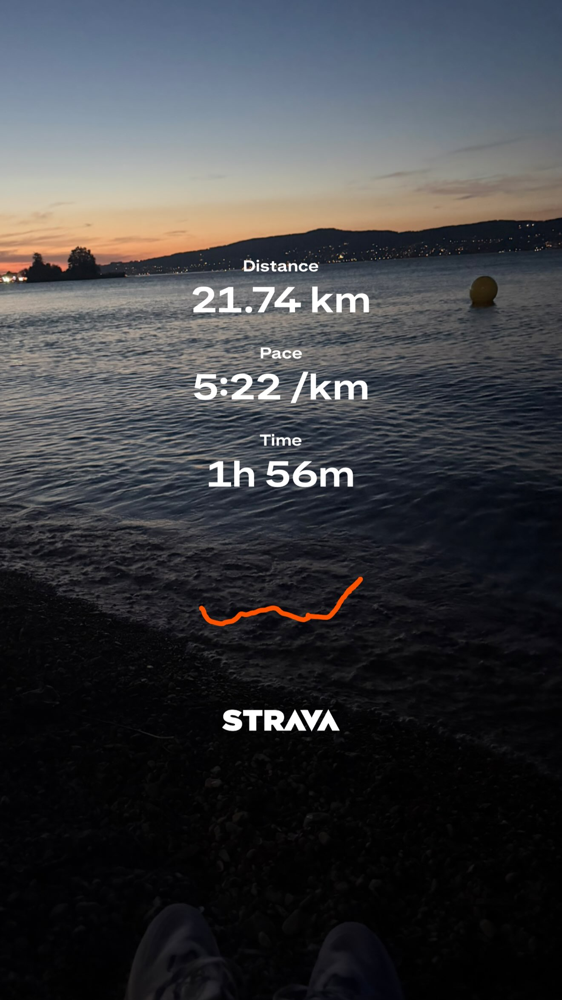

# Days of Running Log

This was a simple place for me to log my runs. It was a basic commitment to myself: get outside, move, and get away from the glow of the screen.

Each commit here is a record of time I spent offline. The goal wasn’t the green squares: it was just a reminder to take a break from the screen every once in a while.

This was a diary of my training towards my first half marathon, which I’ve now completed. No more updates here. Future updates on my running journey can be found here: [Strava](https://www.strava.com/athletes/120269891)

